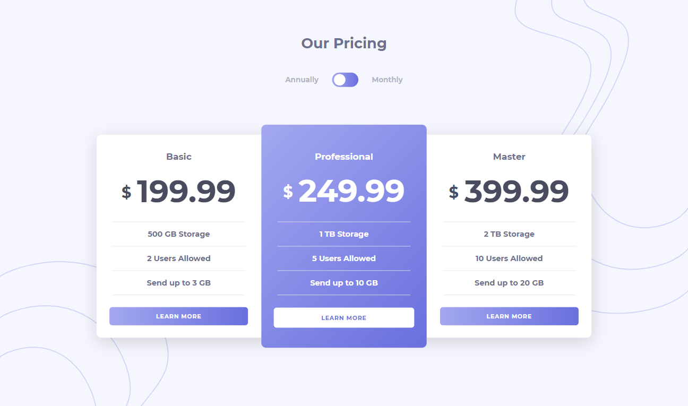
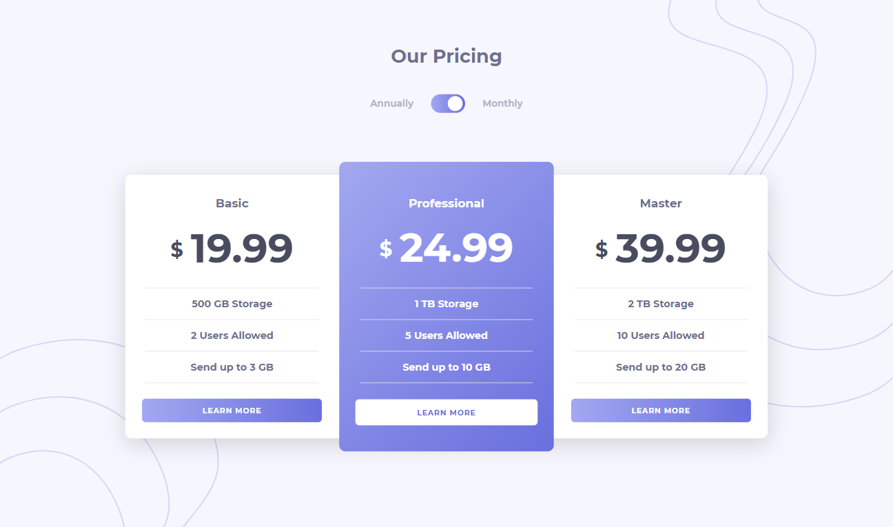
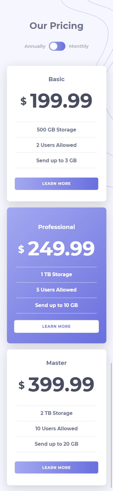
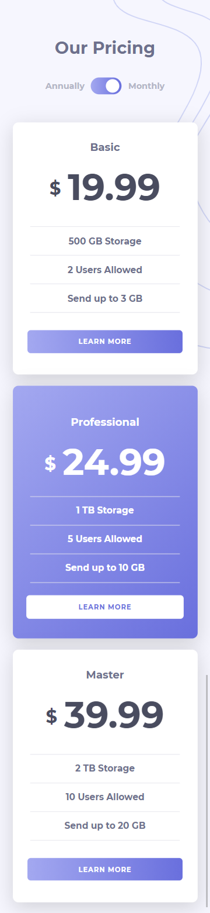

## Getting Started

First, run the development server:

```bash
yarn install

yarn dev
```

Open [http://localhost:3000](http://localhost:3000) with your browser to see the result.

## Desktop Screenshots

### Desktop Annually



### Desktop Monthly 



## Mobile Screenshots

### Mobile Annually



### Mobile Monthly


